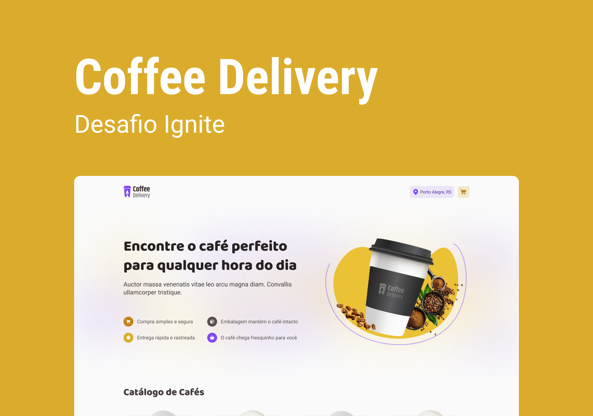

# Coffee Delivery (Desafio Ignite)

Coffee Delivery é um projeto de site de pedidos, que envolve muitos conceitos do React.JS. E é ótimo para treinar diversos tipos de conhecimentos. 

[Link do projeto (Vercel)](https://coffee-delivery-eight-iota.vercel.app)

## Tecnologias usadas

* TypeScritp
* React.Js

### Bibliotecas

* React Hook Form
* Phosphor Icons
* React Toastify
* Zod
* Uniqid